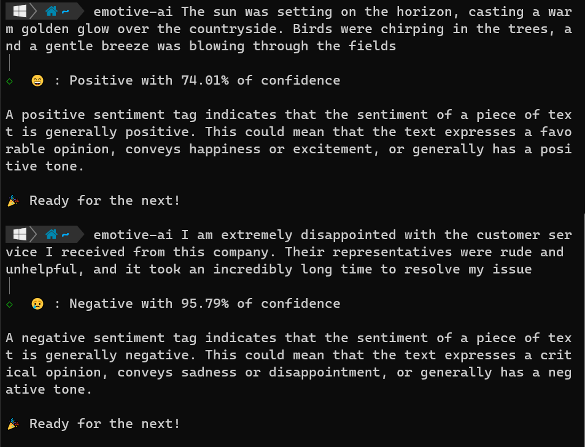

# EmotiveAI


Sentiment and emotion analysis cli that uses machine learning and natural language processing to identify and classify emotions in text data



## Setup

Get your MONKEY_LEARN_API_KEY and MONKEY_LEARN_MODEL_ID from [MonkeyLearn](https://monkeylearn.com/signup/)

> You'll have to create a account and use the trial mode just to test it

Set your API_KEY and MODEL_ID:

```bash
emotive-ai config ui # to use ui prompt directly

emotive-ai config set MONKEY_LEARN_API_KEY=<your key> # for api key

emotive-ai config set MONKEY_LEARN_MODEL_ID=<your model id> # for model
```

## Usage

Recommended

```bash
npx emotive-ai <text>
```

Using global installation

```bash
npm install -g emotive-ai # npm
yarn add global emotive-ai # yarn


emotive-ai <text>
```

## Example

```bash
emotive-ai hello guys
```

> 😄 : Positive with 65.81% of confidence
> A positive sentiment tag indicates that the sentiment of a piece of text is generally positive.This could mean that the text expresses a favorable opinion, conveys happiness or excitement, or generally has a positive tone.

```bash
emotive-ai its really a bad day
```

> 😢 : Negative with 93.82% of confidence
> A negative sentiment tag indicates that the sentiment of a piece of text is generally negative. This could mean that the text expresses a critical opinion, conveys sadness or disappointment, or generally has a negative tone.

## Support

EmotiveAI is an MIT-licensed open source project. It can grow thanks to the sponsors and support by the amazing backers.

## License

EmotiveAI is [MIT licensed](LICENSE).
